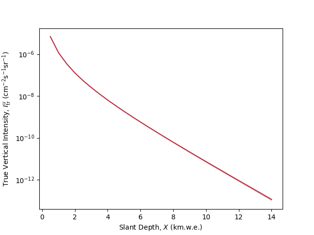

# Tutorial

## Table of Contents

1. [Short Example](#short-example)
2. [Importing All MUTE Modules](#importing-all-mute-modules)
3. [Changing the Constants](#changing-the-constants)
4. [Units](#units)
5. [Slant Depths and Angles](#slant-depths-and-angles)
6. [Calculating Underground Intensities](#calculating-underground-intensities)
7. [Changing the Models](#changing-the-models)
8. [Calculating Underground Fluxes](#calculating-underground-fluxes)
9. [Calculating Total Underground Fluxes](#calculating-total-underground-fluxes)
10. [Calculating Surface Fluxes and Intensities](#calculating-surface-fluxes-and-intensities)
11. [Calculating Survival Probabilities](#calculating-survival-probabilities)
12. [Using MUTE on a Computer Cluster](#using-mute-on-a-computer-cluster)

## Short Example

The nearly-minimal code below will calculate an array of true vertical underground intensities using DDM and SIBYLL-2.3d for an array of 28 default slant depths and will plot them against the slant depths.

```python
# Import packages

import matplotlib.pyplot as plt

import mute.constants as mtc
import mute.underground as mtu

# Set the constants

mtc.set_overburden("flat")
mtc.set_medium("rock")
mtc.set_density(2.65)

# Calculate true vertical intensities for the default slant depths and atmosphere

intensities_DDM = mtu.calc_u_intensities(method = "tr", interaction_model = "DDM")
intensities_SIBYLL = mtu.calc_u_intensities(method = "tr", interaction_model = "SIBYLL-2.3d")

# Plot the results

plt.figure(facecolor = "white")
plt.semilogy(mtc.slant_depths, intensities_DDM, color = "blue", label = "DDM")
plt.semilogy(mtc.slant_depths, intensities_SIBYLL, color = "magenta", label = "SIBYLL-2.3d")
plt.legend()
plt.show()
```



As of [v2.0.0](https://github.com/wjwoodley/mute/releases/tag/2.0.0), MUTE provides calculations for labs under both flat overburdens and mountains.

## Importing All MUTE Modules

The MUTE constants and functions are split between four modules. They can be imported as follows:

```python
import mute.constants as mtc
import mute.surface as mts
import mute.propagation as mtp
import mute.underground as mtu
```

When MUTE is imported for the first time, the data files supplied with the GitHub release will be downloaded to the directory MUTE is installed to. These data files contain some surface flux matrices for the default models and atmosphere as well as survival probability tensors for standard rock and water for simulations of 100 000 muons.

## Changing the Constants

The globally-set constants are stored in the ``constants`` module, and are set using setter functions. The following piece of code sets all of the constants to their default values.

```python
mtc.set_verbose(2)
mtc.set_output(True)
# mtc.set_directory("mute/data")
mtc.set_lab("Default")
mtc.set_overburden("flat")
mtc.set_vertical_depth(0.5)
mtc.set_medium("rock")
mtc.set_density(2.65)
mtc.set_n_muon(100000)
```

The docstrings for each function describe what values they can take.

It is usually best to leave the directory as the default value. Data files downloaded automatically from GitHub will be stored where MUTE is installed (the location of this directory can be found by running ``pip show mute``), as will output data files created while using MUTE. The directory can be changed for ease of use on a computing cluster (see the example in [``/examples/cluster``](../examples/cluster) or the example at the end of this tutorial).

### Loading Mountain Profiles

To define the profile of a moutain, the ``mtc.load_mountain()`` function is used. In order to use this, the overburden type must be set to a mountain with ``mtc.set_overburden("mountain")``. Calling it like this will use the defaults for all of the optional keyword arguments:

```python
mtc.load_mountain(file_name, units = "kmwe", density = 2.65, max_slant_depth = 14)
```

The file name, indicating the full (relative or absolute) path of the file that contains the information for the mountain profile must be provided. The file should have three columns:

1. Zenith angle in degrees
2. Azimuthal angle in degrees
3. Slant depth

For an example see, [``/examples/example_mountain_calculations.ipynb``](../examples/example_mountain_calculations.ipynb).

``units`` refers to the units of the slant depths given in the file. The units can be either ``"m"``, ``"mwe"``, ``"km"``, or ``"kmwe"``. MUTE will convert the slant depths to km.w.e. if they are not already in km.w.e. ``density`` refers to the density of rock used to define the slant depths in the file. ``max_slant_depth`` defines the maximum slant depth that will be considered in the calculations. Any depths in the file that are above this value will be ignored.

## Units

The following are the default units used throughout MUTE:

* **Energies:** MeV
* **Angles:** Degrees
* **Depths:** km.w.e.
* **Fluxes (Flat):** (cm$^2$ s sr MeV)$^{-1}$
* **Fluxes (Mountains):** (cm$^2$ s sr MeV$^2$)$^{-1}$
* **Intensities (Flat):** (cm$^2$ s sr)$^{-1}$
* **Intensities (Mountains):** (cm$^2$ s sr km.w.e.)$^{-1}$
* **Total Fluxes:** (cm$^2$ s)$^{-1}$
* **Survival Probabilities:** (MeV$^2$ km.w.e.)$^{-1}$
* **Densities:** g cm$^{-3}$

## Slant Depths and Angles

**NOTE:** The slant depths and angles in MUTE should not be changed directly. If custom values are needed, the ``depths`` and ``angles`` arguments in the ``mtu.calc_u_intensities()`` and ``mtu.calc_u_tot_flux()`` functions can be used. If these are not sufficient, the final results can be interpolated to custom depths and angles. MUTE will raise an exception if any of ``mtc.ENERGIES``, ``mtc._SLANT_DEPTHS``, ``mtc._ANGLES``, ``mtc.ANGLES_FOR_S_FLUXES``, ``mtc.slant_depths``, or ``mtc.angles`` are changed.

The default slant depths and zenith angles are given by the following constants:

* **``mtc._SLANT_DEPTHS``:** An array of 28 default slant depths between 0.5 km.w.e. and 14 km.w.e., going up in steps of 0.5 km.w.e., defined by ``np.linspace(0.5, 14, 28)``.
```
array([ 0.5,  1. ,  1.5,  2. ,  2.5,  3. ,  3.5,  4. ,  4.5,  5. ,  5.5,
        6. ,  6.5,  7. ,  7.5,  8. ,  8.5,  9. ,  9.5, 10. , 10.5, 11. ,
       11.5, 12. , 12.5, 13. , 13.5, 14. ])
```
* **``mtc._ANGLES``:** An array of 28 default zenith angles corresponding to the default slant depths.
```
array([ 0.        , 60.        , 70.52877937, 75.52248781, 78.46304097,
       80.40593177, 81.7867893 , 82.81924422, 83.62062979, 84.26082952,
       84.78409143, 85.21980815, 85.58827421, 85.90395624, 86.17744627,
       86.4166783 , 86.62771332, 86.81526146, 86.98303869, 87.13401602,
       87.27059736, 87.39474873, 87.50809363, 87.61198454, 87.70755722,
       87.7957725 , 87.87744864, 87.9532869 ])
```
* **``mtc.ANGLES_FOR_S_FLUXES``:** An array of 20 default equally-spaced zenith angles between 0 degrees and 90 degrees for use in calculate the surface fluxes.
```
array([ 0.        ,  4.73684211,  9.47368421, 14.21052632, 18.94736842,
       23.68421053, 28.42105263, 33.15789474, 37.89473684, 42.63157895,
       47.36842105, 52.10526316, 56.84210526, 61.57894737, 66.31578947,
       71.05263158, 75.78947368, 80.52631579, 85.26315789, 90.        ])
```

All calculations of surface flux matrices, survival probability tensors, and undeground flux matrices and tensors are done using these default values. For calculations after these basic steps, like those for underground intensities, interpolations are done to the values in ``mtc.slant_depths`` and ``mtc.angles`` (which have default values ``mtc._SLANT_DEPTHS`` and ``mtc._ANGLES`` respectively).

### Flat Overburdens

For a flat overburden, when the vertical depth, $h$, is set, the values of ``mtc.slant_depths`` and ``mtc.angles`` change according to:

$$h = X\cos(\theta),$$

where $X$ is the slant depth, and $\theta$ is the zenith angle. For a lab 3.1 km.w.e. underground (or underwater), the vertical depth can be set with ``mtc.set_vertical_depth(3.1)``. Then, printing ``mtc.slant_depths`` gives:

```
array([ 3.1,  3.5,  4. ,  4.5,  5. ,  5.5,  6. ,  6.5,  7. ,  7.5,  8. ,
        8.5,  9. ,  9.5, 10. , 10.5, 11. , 11.5, 12. , 12.5, 13. , 13.5,
       14. ])
```

The angles in ``mtc.angles`` are set according to these depths as well:

$$\theta=\arccos\left(\frac{h}{X}\right).$$

```
array([ 0.        , 27.6604499 , 39.19496743, 46.45778097, 51.68386553,
       55.69234854, 58.89107749, 61.5153646 , 63.71367932, 65.58559769,
       67.20096873, 68.61051667, 69.85211371, 70.95468924, 71.94076951,
       72.82818485, 73.6312505 , 74.3616036 , 75.028809  , 75.64080601,
       76.2042431 , 76.72473252, 77.20704627])
```

[PROPOSAL](https://github.com/tudo-astroparticlephysics/PROPOSAL) is optimised for propagating leptons through long ranges of matter. Due to this limitation of propagating muons short distances, the minimum vertical depth in MUTE is set to 0.5 km.w.e. It is possible to set vertical depths below this, using ``mtc.shallow_extrapolation``:

```python
mtc.shallow_extrapolation = True
mtc.set_vertical_depth(0.1)
```

However, this is not recommended. Results that depend on extrapolation up to shallow depths are not guaranteed to be stable or correct.

### Mountains

``mtc.slant_depths`` and ``mtc.angles`` are not used for mountain overburdens. Instead, after loading the mountain profile (see [above](#loading-mountain-profiles)), MUTE makes available three new global variables that are used to access the angles and slant depths from the mountain profile. They are:

* **``mtc.mountain.zenith``:** An array of unique and sorted zenith angles from the file, in degrees.
* **``mtc.mountain.azimuthal``:** An array of unique and sorted azimuthal angles from the file, in degrees.
* **``mtc.mountain.slant_depths``:** A matrix of unique and sorted slant depths from the file, in km.w.e.

Note that these are immutable objects. They can only be changed by changing the contents of the profile file that is loaded.

## Calculating Underground Intensities

Underground intensities can be calculated using the function ``mtu.calc_u_intensities()``. This function takes one required argument, ``method``, and many optional keyword arguments.

There are four methods available:

* **``"sd"``:** Single differential underground intensities (see [below](#single-differential-underground-intensities)).
* **``"eq"``:** Vertical-equivalent underground intensities (see [below](#vertical-equivalent-underground-intensities)).
* **``"tr"``:** True vertical underground intensities (see [below](#true-vertical-underground-intensities)).
* **``"dd"``:** Double-differential underground intensities (see [below](#double-differential-underground-intensities)).

The first three are for flat overburdens, and the last one is for mountain calculations.

### Single-Differential Underground Intensities

Single-differential underground intensities are those defined by the following equation:

$$I^u(\theta)=\int_{E_{\mathrm{th}}}^{\infty}\mathrm{d}E^u\Phi^u(E^u, \theta),$$

where $I^u(\theta)$ is the underground intensity, $E_{\mathrm{th}}$ is an energy threshold, $E^u$ is the underground energy, and $\Phi^u(E^u, \theta)$ is the underground flux.

#### Calling the Function

Running the line below will use the defaults for all of the arguments:

```python
mtu.calc_u_intensities(method = "sd", output = None, file_name = "", force = False, u_fluxes = None, s_fluxes = None, survival_probability_tensor = None, angles = mtc.angles, E_th = 0, primary_model = "GSF", interaction_model = "SIBYLL-2.3c", atmosphere = "CORSIKA", location = "USStd", month = None)
```

This returns a one-dimensional array of length ``len(angles)``. The underground intensities in the array will have units of (cm$^2$ s sr)$^{-1}$.

The value for ``output`` will be taken from ``mtc.get_output()``, and the value for ``file_name`` will be constructed based on the values of ``mtc.get_lab()`` and ``method``.

If the surface flux or survival probability matrices that are required to calculate the underground fluxes are not found, MUTE will ask if they should be created. To skip this prompt and force them to be created if they are needed, set ``force`` to ``True``. No matter what ``force`` is set to, if a matrix is output to a file, it will always overwrite any existing file with the same name.

#### Keyword Arguments

The possible keyword arguments and their default values are:

* **``u_fluxes``:** An underground flux tensor of shape ``(28, 91, 20)``. If none is given, one is calculated using the given ``s_fluxes`` matrix and / or ``survival_probability tensor``, or the given or default models and global propagation constants.
* **``s_fluxes``:** A surface flux matrix of shape ``(91, 20)``. If none is given, one is loaded using the default or set arguments for the models.
* **``survival_probability_tensor``:** A survival probability tensor of shape ``(91, 28, 91)``. If none is given, one is loaded using the default or set global propagation constants.
* **``angles``:** An array of zenith angles in degrees to calculate the underground intensities for. If none is given, ``mtc.angles`` is used.
* **``depths``:** An array of slant depths in km.w.e. to calculate the underground intensities for. If none is given, ``mtc.slant_depths`` is used.
* **``E_th``:** An energy threshold in MeV. If none is given, 0 is used.
* **``primary_model``:** The primary flux model to use in MCEq. See the options [below](#changing-the-primary-model). If none is given, ``"GSF"`` is used.
* **``interaction_model``:** The hadronic interaction model to use in MCEq. See the options [below](#changing-the-interaction-model). If none is given, ``"SIBYLL-2.3c"`` is used.
* **``atmosphere``:** The atmospheric model. See the options [below](#changing-the-atmosphere). If none is given, ``"CORSIKA"`` is used.
* **``location``:** The name of the location for which to calculate the surface fluxes. See the options [below](#changing-the-atmosphere). If none is given, ``"USStd"`` is used.
* **``month``:** The month for which to calculate the surface fluxes.

Multiple options are available to calculate underground intensities: different combinations of tensors can be provided from which to calculate the intensities, or different combinations of models can be provided. To calculate underground intensities using the ZatsepinSokolskaya primary model, for example, one can do:

```python
u_fluxes = mtu.calc_u_fluxes(primary_model = "ZS")

mtu.calc_u_intensities(method = "sd", u_fluxes = u_fluxes)
```

This is equivalent to:

```python
s_fluxes = mts.calc_s_fluxes(primary_model = "ZS")

mtu.calc_u_intensities(method = "sd", s_fluxes = s_fluxes)
```

This is equivalent to:

```python
mtu.calc_u_intensities(method = "sd", primary_model = "ZS")
```

Which is the most appopriate or efficient depends on the specific use case.

The arguments are listed in their order of precedence. For example, if both ``u_fluxes`` and ``s_fluxes`` are provided, only ``u_fluxes`` will be used, because it is higher in the list than ``s_fluxes``.

If no underground flux tensor is provided, the surface flux matrix and survival probability tensor are used to calculate one. If no surface flux matrix is provided, the function calls ``mts.load_s_fluxes_from_file()``, which searches for a surface flux file that has a name matching the set models and atmosphere. If no survival probability tensor is provided, the function calls ``mtp.load_survival_probability_tensor_from_file()``, which searches for a survival probability file that has a name matching the set global parameters. If it finds the required files, it will load the surface fluxes and / or survival probabilities from those files. If it does not, it will try to calculate new surface fluxes and / or survival probabilities.

#### Specifying Angles

The function call above will return an array of underground muon intensities for the 28 default angles (or otherwise, depending on the value set for the vertical depth; see [above](#flat-overburdens)). The angles can be changed by passing angles in degrees (float or array-like) into the function. To return the underground intensities for 100 angles between 20 and 85 degrees, for example, one can do:

```python
angles = np.linspace(20, 85, 100)

mtu.calc_u_intensities(method = "sd", angles = angles)
```

The function will interpolate over the default energy and angle grids to get the underground intensities at these angles.

### Vertical-Equivalent Underground Intensities

Vertical-equivalent underground intensities are those defined by the following equation:

$$I^u_{\mathrm{eq}}(\theta)=I^u(\theta)\cos(\theta),$$

where $I^u_{\mathrm{eq}}(\theta)$ is the vertical-equivalent underground intensity, and $I^u(\theta)$ is the single-differential underground intensity, described [above](#single-differential-underground-intensities).

#### Calling the Function

The function is called identically to that for single-differential underground intensities (see [above](#single-differential-underground-intensities)). The same keyword arguments are accepted, and angles are specified in the same way. The only difference is that ``method`` must be ``"eq"`` instead of ``"sd"``. Running the line below will use the defaults for all of the arguments:

```python
mtu.calc_u_intensities(method = "eq", output = None, file_name = "", force = False, u_fluxes = None, s_fluxes = None, survival_probability_tensor = None, angles = mtc.angles, E_th = 0, primary_model = "GSF", interaction_model = "SIBYLL-2.3c", atmosphere = "CORSIKA", location = "USStd", month = None)
```

This returns a one-dimensional array of length ``len(angles)``. The underground intensities in the array will have units of (cm$^2$ s sr)$^{-1}$.

For an example, see [``/examples/example_vertical_intensities.ipynb``](../examples/example_vertical_intensities.ipynb).

### True Vertical Underground Intensities

True vertical underground intensities are those defined by the following equation:

$$I^u_{\mathrm{tr}}(X)=\int_{E_{\mathrm{th}}}^{\infty}\mathrm{d}E^u\Phi^u(E^u, X, \theta=0),$$

where $I^u_{\mathrm{tr}}$ is the true vertical underground intensity.

#### Calling the Function

The function is called similarly to that for single-differential underground intensities (see [above](#single-differential-underground-intensities)). The main differences are that ``method`` must be ``"tr"`` instead of ``"sd"``, and that the function takes an optional ``depth`` argument, which takes its default values from ``mtc.slant_depths``, instead of an ``angles`` argument. Running the line below will use the defaults for all of the arguments:

```python
mtu.calc_u_intensities(method = "tr", output = None, file_name = "", force = False, u_fluxes = None, s_fluxes = None, survival_probability_tensor = None, depths = mtc.slant_depths, E_th = 0, primary_model = "GSF", interaction_model = "SIBYLL-2.3c", atmosphere = "CORSIKA", location = "USStd", month = None)
```

This returns a one-dimensional array of length ``len(depths)``. The underground intensities in the array will have units of (cm$^2$ s sr)$^{-1}$.

For an example, see [``/examples/example_vertical_intensities.ipynb``](../examples/example_vertical_intensities.ipynb).

The slant depths can be changed by passing slant depths in km.w.e. (float or array-like) into the function. To return the true vertical underground intensities for 40 slant depths between 3 and 10 km.w.e., for example, one can do:

```python
depths = np.linspace(3, 10, 40)

mtu.calc_u_intensities(method = "tr", depths = depths)
```

### Double-Differential Underground Intensities

Double-differential underground intensities are those defined by the following equation:

$$I^u_{\mathrm{dd}}(X(\theta, \phi), \theta)=\int_{E_{\mathrm{th}}}^{\infty}\mathrm{d}E^u\Phi^u(E^u, X, \theta),$$

where $I^u_{\mathrm{dd}}(X(\theta, \phi), \theta)$ is the double-differential underground intensity, and $\phi$ is the azimuthal angle.

#### Calling the Function

The function is called similarly to that for single-differential underground intensities (see [above](#single-differential-underground-intensities)). The main differences are that ``method`` must be ``"dd"`` instead of ``"sd"``, and that the function takes neither an ``angles`` argument nor a ``depths`` argument. Running the line below will use the defaults for all of the arguments:

```python
mtu.calc_u_intensities(method = "dd", output = None, file_name = "", force = False, u_fluxes = None, s_fluxes = None, survival_probability_tensor = None, E_th = 0, primary_model = "GSF", interaction_model = "SIBYLL-2.3c", atmosphere = "CORSIKA", location = "USStd", month = None)
```

This returns a two-dimensional array of shape ``(len(mtc.mountain.zenith), len(mtc.mountain.azimuthal))``. The underground intensities in the array will have units of (cm$^2$ s sr km.w.e.)$^{-1}$.

## Changing the Models

### Changing the Primary Model

The default primary cosmic ray flux model is ``"GSF"``, for GlobalSplineFitBeta, and is set with the ``primary_model`` keyword argument. The following primary models are available to be set with a string:

* ``"GSF"``: GlobalSplineFitBeta
* ``"HG"``: HillasGaisser2012 (H3a)
* ``"GH"``: GaisserHonda
* ``"ZS"``: ZatsepinSokolskaya (Default)
* ``"ZSP"``: ZatsepinSokolskaya (PAMELA)
* ``"PL27"``: SimplePowerlaw27

To calculate underground intensities for GaisserHonda, for example, one can do:

```python
mtu.calc_u_intensities(method = "sd", primary_model = "GH")
```

Alternatively, in the ``mts.calc_s_fluxes()`` function, the primary model may be set using a tuple. This gives access to the rest of the models available in MCEq. For example:

```python
import crflux.models as pm

s_fluxes = mts.calc_s_fluxes(primary_model = (pm.GaisserStanevTilav, "3-gen"))

mtu.calc_u_intensities(method = "sd", s_fluxes = s_fluxes)
```

This option is only available in the ``mts.calc_s_fluxes()`` function. The other loading and calculation functions require the primary model to be specified with one of the strings in the list above, as they will search for files with names that contain the strings.

For more information, see the [MCEq Documentation](https://mceq.readthedocs.io/en/latest/tutorial.html#changing-cosmic-ray-flux-model) and the [crflux Documentation](https://crfluxmodels.readthedocs.io/en/latest/index.html). For an example, see [``/examples/example_primary_flux_models.ipynb``](../examples/example_primary_flux_models.ipynb).

### Changing the Interaction Model

The default hadronic interaction model is ``"SIBYLL-2.3c"``, and is set with the ``interaction_model`` keyword argument. The following hadronic interaction models are available:

* ``"DDM"``
* ``"DDM_err_pos"`` (for positive errors on DDM)
* ``"DDM_err_neg"`` (for negative errors on DDM)
* ``"SIBYLL-2.3d"``
* ``"SIBYLL-2.3d_pos"`` (for positive errors on SIBYLL-2.3d)
* ``"SIBYLL-2.3d_err_neg"`` (for negative errors on SIBYLL-2.3d)
* ``"SIBYLL-2.3c"``
* ``"SIBYLL-2.3"``
* ``"SIBYLL-2.1"``
* ``"EPOS-LHC"``
* ``"QGSJet-II-04"``
* ``"QGSJet-II-03"``
* ``"QGSJet-01c"``
* ``"DPMJET-III-3.0.6"``
* ``"DPMJET-III-19.1"``
* ``"SIBYLL-2.3c_pp"``

Note that ``"DDM"`` and ``"SIBYLL-2.3d"`` (and their errors) are only available using the files provided by MUTE from GitHub for the default primary model ``"GSF"``; MCEq cannot currently calculate new matrices for these models. They will be implemented in v1.4 of MCEq.

To calculate underground intensities for EPOS-LHC, for example, one can do:

```python
mtu.calc_u_intensities(method = "sd", interaction_model = "EPOS-LHC")
```

For more information, see the [MCEq Documentation](https://mceq.readthedocs.io/en/latest/tutorial.html#changing-hadronic-interaction-models). While MCEq will remove the dashes and points, in order for MUTE to find the correct file when calculating the underground fluxes, the dashes, dots, and capitalisation must match exactly what was used when the function was first run.

### Changing the Atmosphere

The default atmosphere is [US Standard Atmosphere](https://ntrs.nasa.gov/citations/19770009539). Using the default is equivalent to running:

```python
mtu.calc_u_intensities(method = "sd", atmosphere = "CORSIKA", location = "USStd", month = None)
```

In order to calculate underground fluxes and intensities (and thus the surface fluxes) at a given location, ``atmosphere`` must be set to ``"MSIS00"`` (the [NRLMSISE-00 model](https://agupubs.onlinelibrary.wiley.com/doi/full/10.1029/2002JA009430) is used to calculate seasonal variations of the atmsophere). ``month`` must also be set to one of the months of the year as a string (``"January"``, ``"February"``, etc.).

The following will calculate underground intensities for Tokyo in July:

```python
mtu.calc_u_intensities(method = "sd", atmosphere = "MSIS00", location = "Tokyo", month = "July")
```

The following locations are available:

* ``"SouthPole"``
* ``"Karlsruhe"``
* ``"Geneva"``
* ``"Tokyo"``
* ``"SanGrasso"``
* ``"TelAviv"``
* ``"KSC"``
* ``"SoudanMine"``
* ``"Tsukuba"``
* ``"LynnLake"``
* ``"PeaceRiver"``
* ``"FtSumner"``

Additional locations specified by ``(longitude, latitude, altitude)`` coordinates can be added by editing the MCEq source code.

Month names are given in the variables ``mtc.MONTHS`` and ``mtc.MONTHS_SNAMES``, which are, respectively:

```python
["January", "February", "March", "April", "May", "June", "July", "August", "September", "October", "November", "December"]
```
```python
["Jan.", "Feb.", "Mar.", "Apr.", "May.", "Jun.", "Jul.", "Aug.", "Sep.", "Oct.", "Nov.", "Dec."]
```

For an example of calculations of seasonal variations at the surface and underground, see [``/examples/example_seasonal_variations.ipynb``](../examples/example_seasonal_variations.ipynb).

## Calculating Underground Fluxes

Underground fluxes in MUTE are calculated by convolving the results from MCEq for the surface flux with the results from PROPOSAL for the survival probabilities:

$$\Phi^u(E^u, X, \theta)=\sum_{E^s}\Phi^s(E^s, \theta)P(E^s, E^u, X)\left(\frac{\Delta E^s}{\Delta E^u}\right),$$

where $\Phi^u(E^u, X, \theta)$ is the underground flux, $\Phi^s(E^s, \theta)$ is the surface flux, $P(E^s, E^u, X)$ is the survival probability tensor, and $\Delta E^s$ and $\Delta E^u$ are the energy bin widths for the surface and underground energies respectively.

Underground fluxes can be calculated using the ``mtu.calc_u_fluxes()`` function. Its arguments are similar to those for ``mtu.calc_u_intensities()`` (see [above](#single-differential-underground-intensities)), with some differences. There are no ``method``, ``u_fluxes``, or ``E_th`` arguments for this function. Additionally, it can take a ``full_tensor`` argument. Running the line below will use the defaults for all of the arguments:

```python
mtu.calc_u_fluxes(s_fluxes = None, survival_probability_tensor = None, full_tensor = False, primary_model = "GSF", interaction_model = "SIBYLL-2.3c", atmosphere = "CORSIKA", location = "USStd", month = None, output = None, file_name = "", force = False)
```

For a flat overburden, this function will return a two-dimensional array of shape ``(91, 28)``, where the zeroth axis is the underground energies, and the first axis is the zenith angles. The units of the underground fluxes will be (cm$^2$ s sr MeV)$^{-1}$. If the argument ``full_tensor`` is set to ``True``, the full three-dimensional array will be returned, rather than a two-dimensional array, as it is for the case of a mountain.

For a mountain, this function will return a three-dimensional array of shape ``(28, 91, 20)``, where the zeroth axis is the slant depths, the first axis is the underground energies, and the second axis is the zenith angles (from ``mtc.ANGLES_FOR_S_FLUXES``). The units of the underground fluxes will be (cm$^2$ s sr MeV$^2$)$^{-1}$.

For an example, see [``/examples/example_underground_flux.ipynb``](../examples/example_underground_flux.ipynb).

## Calculating Total Underground Fluxes

Total underground fluxes are calculated by integrating the underground intensities over the angles. For a flat overburden, symmetry is assumed for the azimuthal angle. Integration over the azimuthal angle, therefore, gives a factor of $2\pi$. The calculation, then, only deals with the integration over the zenith angle:

$$\Phi_{\mathrm{tot}}^{u}=2\pi\int_0^{c_{\mathrm{max}}}\mathrm{d}\cos(\theta)I^u(\theta),$$

where $\Phi_{\mathrm{tot}}^{u}$ is the total underground flux, and $c_{\mathrm{max}}$ is the cosine of the maximum zenith angle from ``angles``.

For mountains, the azimuthal angles are taken from the mountain profile file. Therefore, the integration is done over both angles in the calculation:

$$\Phi_{\mathrm{tot}}^{u}=\int_{\phi_{\mathrm{min}}}^{\phi_{\mathrm{max}}}\int_{c_{\mathrm{min}}}^{c_{\mathrm{max}}}\mathrm{d}\cos(\theta)\mathrm{d}\phi I^u_{\mathrm{dd}}(X(\theta, \phi), \theta),$$

where $\phi_{\mathrm{min}}$, $\phi_{\mathrm{max}}$, $c_{\mathrm{min}}$, and $c_{\mathrm{max}}$ are the minimum and maximum azimuthal and cosine of the zenith angles given in the mountain profile file.

Total underground fluxes can be calculated using the ``mtu.calc_u_tot_fluxes()`` function. Its arguments are similar to those for ``mtu.calc_u_intensities()`` (see [above](#single-differential-underground-intensities)), with some differences. There is no ``method`` argument for this function (for flat overburdens, it will use ``method = "sd"`` to calculate underground intensities, and for mountains, it will use ``method = "dd"``). Additionally, it can take an ``angle`` argument, but not a ``depths`` argument. Lastly, there are no ``output`` or ``file_name`` arguments. Running the line below will use the defaults for all of the arguments:

```python
mtu.calc_u_tot_fluxes(force = False, s_fluxes = None, survival_probability_tensor = None, angles = mtc.angles, E_th = 0, primary_model = "GSF", interaction_model = "SIBYLL-2.3c", atmosphere = "CORSIKA", location = "USStd", month = None)
```

For both flat overburdens and mountains, this function returns a single number (a float) in units of (cm$^2$ s)$^{-1}$.

## Calculating Surface Fluxes and Intensities

### Surface Fluxes

Surface flux matrices can be calculated using the ``mts.calc_s_fluxes()`` function, which makes use of [MCEq](https://github.com/afedynitch/MCEq). Its arguments are similar to those for ``mtu.calc_u_fluxes()`` (see [above](#calculating-underground-fluxes)), with the only differences being the absence of the ``s_fluxes`` and ``full_tensor`` arguments. Running the line below will use the defaults for all of the arguments:

```python
mts.calc_s_fluxes(primary_model = "GSF", interaction_model = "SIBYLL-2.3c", atmosphere = "CORSIKA", location = "USStd", month = None, output = None, file_name = "", force = False, test = False)
```

This returns a two-dimensional array of shape ``(91, 20)``, where the zeroth axis is the surface energies, and the first axis is the zenith angles (from ``mtc.ANGLES_FOR_S_FLUXES``). The surface energy grid used throughout MUTE (``mtc.ENERGIES``) is the energy grid provided by MCEq, but with energies beyond 100 PeV cut, as the surface flux for energies higher than this is negligible for depths up to 14 km.w.e.

To calculate surface fluxes using the HillasGaisser2012 primary flux model for Gran Sasso in January, for example, one can do:

```python
mts.calc_s_fluxes(primary_model = "HG", atmosphere = "MSIS00", location = "SanGrasso", month = "January")
```

After a surface flux matrix has been calculated, it can be passed into other functions with the ``s_fluxes`` argument. Additionally, if an output file was produced, the matrix can be read back in from this output file using the ``mts.load_s_fluxes_from_file()`` function. This function can take either a file name, or the same arguments as ``mts.calc_s_fluxes()`` to define the models. To load the output file produced by the line of code just above, for example, one can do:

```python
mts.load_s_fluxes_from_file(primary_model = "HG", atmosphere = "MSIS00", location = "SanGrasso", month = "January")
```

### Surface Intensities

Surface intensities are single-differential intensities calculated by integrating the surface fluxes over the surface energies:

$$I^s(\theta)=\int^{\infty}_0\mathrm{d}E^s\Phi^s(E^s, \theta),$$

where $I^s(\theta)$ is the surface intensity, $E^s$ is the surface energy, and $\Phi^s(E^s, \theta)$ is the surface flux.

Surface intensities can be calculated using the ``mts.calc_s_intensities()`` function. Its arguments are similar to ``mts.calc_s_fluxes()`` (see [above](#surface-fluxes)), with the addition of an ``s_fluxes`` argument to pass a surface flux matrix into the function. Running the line below will use the defaults for all of the arguments:

```python
mts.calc_s_intensities(s_fluxes = None, primary_model = "GSF", interaction_model = "SIBYLL-2.3c", atmosphere = "CORSIKA", location = "USStd", month = None, output = None, file_name = "", force = False)
```

This returns a one-dimensional array of length ``20`` (from ``mtc.ANGLES_FOR_S_FLUXES``). The surface intensities in the array will have units (cm$^2$ s sr)$^{-1}$.

### Total Surface Fluxes

Total surface fluxes are calculated by integrating the surface intensities over the angles. At the surface, symmetry is assumed for the azimuthal angle. Integration over the azimuthal angle, therefore, gives a factor of $2\pi$. The calculation, then, only deals with the integration over the zenith angle:

$$\Phi_{\mathrm{tot}}^{s}=2\pi\int_0^1\mathrm{d}\cos(\theta)I^s(\theta),$$

where $\Phi_{\mathrm{tot}}^{s}$ is the total surface flux.

Total surface fluxes can be calculated using the ``mts.calc_s_tot_fluxes()`` function. Its arguments are similar to those for ``mts.calc_s_intensities()`` (see [above](#surface-intensities)), with the only difference being the absence of the ``output`` and ``file_name`` arguments. Running the line below will use the defaults for all of the arguments:

```python
mts.calc_s_tot_fluxes(s_fluxes = None, primary_model = "GSF", interaction_model = "SIBYLL-2.3c", atmosphere = "CORSIKA", location = "USStd", month = None, force = False)
```

This returns a single number (a float) in units of (cm$^2$ s)$^{-1}$.

## Calculating Survival Probabilities

The main functions in ``mute.propagation`` used for the propagation of muons through matter and the calculation of survival probability tensors are:

1. ``mtp.propagate_muons(seed = 0, job_array_number = 0, output = None, force = False)``
2. ``mtp.calc_survival_probability_tensor(seed = 0, file_name_pattern = None, n_job = 1, output = None, file_name = "", force = False)``

For general purposes, the second function can be used. It will check if underground (or underwater, etc.) muon energies for the set global propagation constants have been specified or already exist. If they do, it will load them and calculate survival probabilities. If they do not, it will call ``mtp.propagate_muons()``, which begins the Monte Carlo simulation using [PROPOSAL](https://github.com/tudo-astroparticlephysics/PROPOSAL).

The ``mtp.calc_survival_probability_tensor()`` function will return a three-dimensional array of shape ``(91, 28, 91)``, where the zeroth axis is the surface energies, the first axis is the slant depths, and the second axis is the underground energies. The units of the survival probabilities will be (MeV$^2$ km.w.e.)$^{-1}$.

After a survival probability tensor has been calculated, it can be passed into other functions with the ``survival_probability_tensor`` argument. Additionally, if an output file was produced, the tensor can be read back in from this output file using the ``mtp.load_survival_probability_tensor_from_file()`` function. This function can take an optional file name from which to load the survival probabilities:

```python
mtp.load_survival_probability_tensor_from_file(file_name = "", force = False)
```

If no file name is given, one is constructed based on the set global propagation constants.

For an example, see [``/examples/example_load_survival_probability_tensor.ipynb``](../examples/example_load_survival_probability_tensor.ipynb).

## Using MUTE on a Computer Cluster

For high-statistics simulations on a computer cluster, the ``mtp.propagation_muons()`` function is the most useful. The MUTE code to set up a job array of Monte Carlo simulations for 1000 muons per energy-slant depth bin (per job) can be written as follows:

```python
# Import packages

import argparse

import mute.constants as mtc
import mute.propagation as mtp

# Parse the job array number from the command line

parser = argparse.ArgumentParser()
parser.add_argument("job_array_number", type = int)
args = parser.parse_args()

# Set the constants

mtc.set_verbose(0)
mtc.set_output(True)
mtc.set_directory("mute/data")
mtc.set_lab("Example")
mtc.set_n_muon(1000)

# Propagate the muons

mtp.propagate_muons(seed = args.job_array_number, job_array_number = args.job_array_number, force = True)
```

To prevent any unnecessary output, the verbosity can be set to ``0`` (though it might be a good idea to keep it at the default ``2`` to help figure out what went wrong if the job fails). To make it easier to access and ``sftp`` out the output Monte Carlo underground energy files, the directory can be changed to the working directory of the code or elsewhere. The ``force`` parameter in ``mtc.propagate_muons()`` should be set to ``True`` to force the creation of any required directories or files so the program does not hang, waiting for user input until the job times out.

The seed, which can be changed in the propagation function to ensure the Monte Carlo results are different for each job, and the job array number can be both read in from the command line using ``argparse``. If the job array consisted of 100 jobs, the survival probabilities can then be calculated as below, setting the ``n_job`` argument in the ``mtp.calc_survival_probability_tensor()`` function to ``100``:

```python
import mute.constants as mtc
import mute.propagation as mtp

mtc.set_lab("Example")
mtc.set_n_muon(100000)

mtp.calc_survival_probability_tensor(n_job = 100)
```

Here, ``seed`` does not need to be set in ``mtp.calc_survival_probability_tensor()`` because this function will not invoke ``mtp.propagate_muons()``, since the underground energies have already been loaded. Note also that the number of muons was set to 1000 when running the propagation, but is set to 100000 in the code just above. By setting ``n_job`` to 100, MUTE will recognise that the 100000 muons were split evenly between 100 jobs of 1000 muons each, and will search for underground energy files corresponding to 1000 muons.